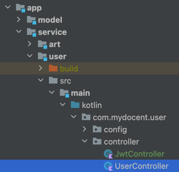

## 실행 시켜보기

### description
1. port 8080
2. 준비물 Java 17
### command
`./gradlew :app:service:auth:bootRun`

1. 프로젝트의 루트 디렉토리에서 실행시켜주세요.

 
 
+ 프롬프트 최하단에 아래와 같이 출력되면 서버가 성공적으로 실행한 것 입니다.

`[           main] c.mydocent.auth.MyDocentApplicationKt    : Started MyDocentApplicationKt in 3.301 seconds (process running for 3.547)
`

    

---
## API

### oauth api
1. 카카오 로그인창 접근
   + path: {host}/oauth2/authorization/kakao
   + 로그인 완료 후 `access-token`, `refresh-token` cookie를 발급해줍니다.

    
   

### 테스트용 api
user module의 controller에 구현한 api 사용해주세요.

